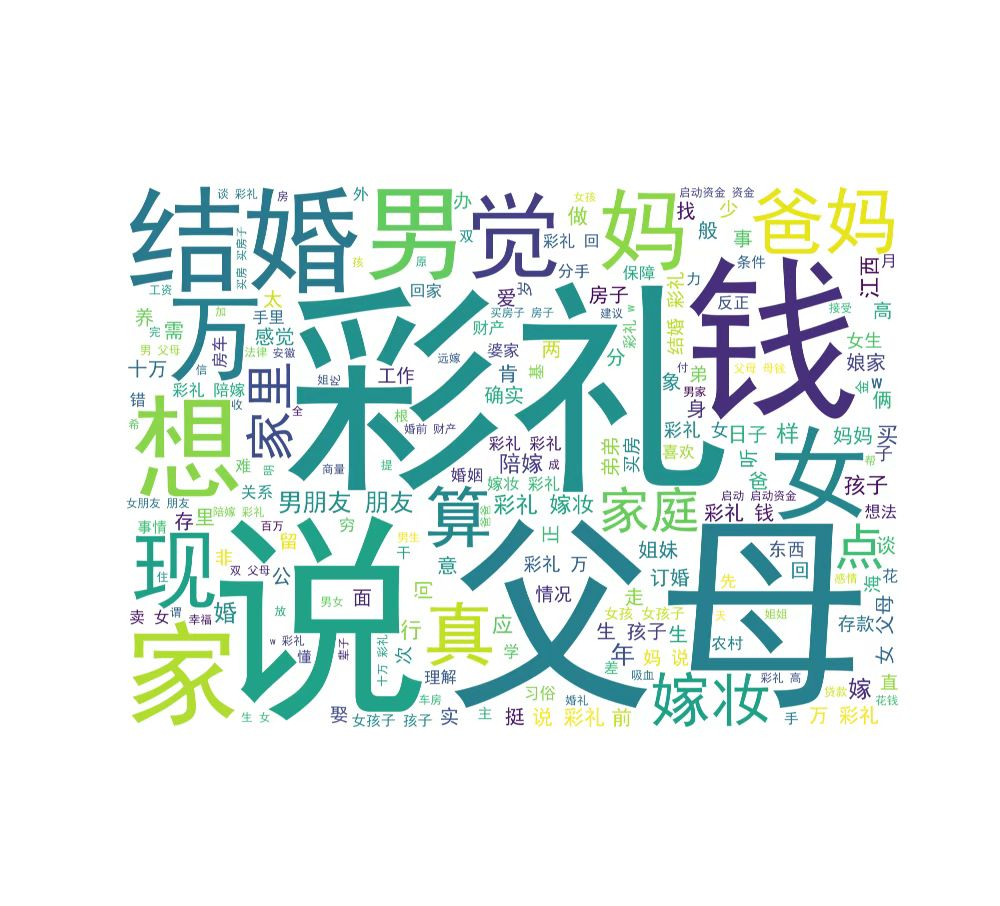
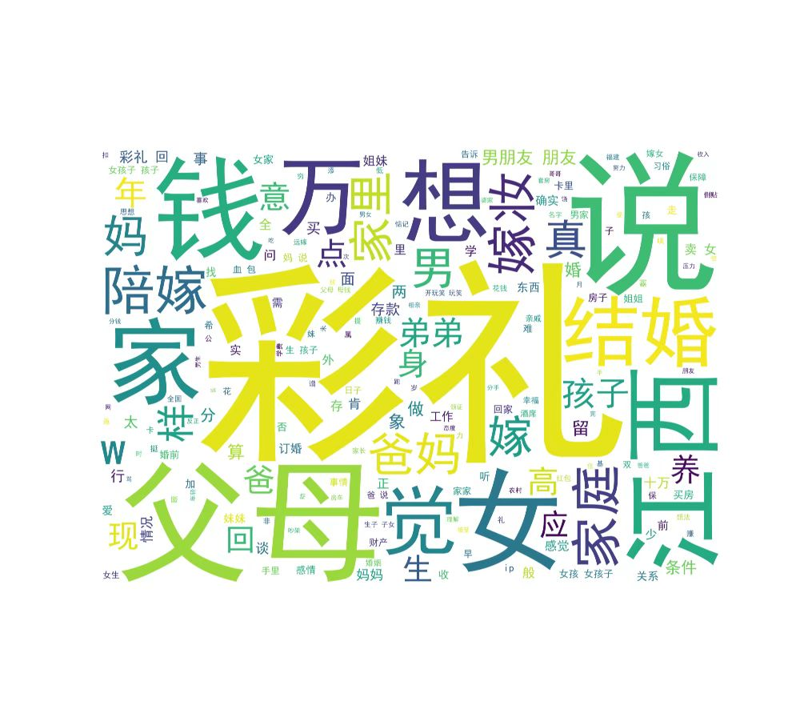
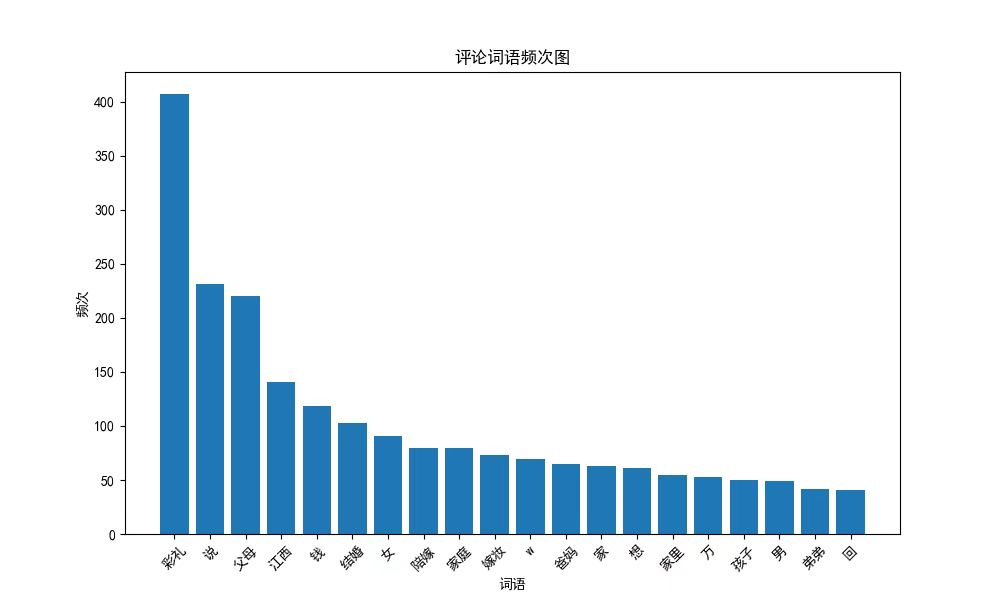
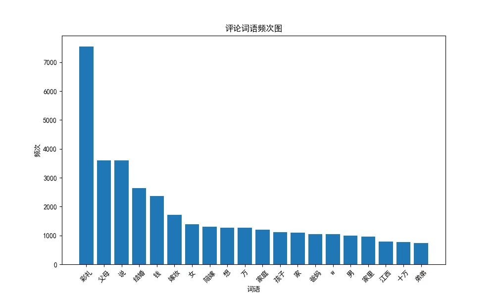

# 💍 哈集美模拟器 | HaJieMei Simulator

> 
> 一款基于大模型的小红书彩礼话题AI评论生成与数据分析工具

## 📖 项目简介

「哈集美模拟器」是一个融合自然语言处理与社会学观察的创新型项目。我们利用Qwen3-14B大模型与LoRA微调技术，训练出能够模拟小红书社区中关于彩礼话题评论风格的AI模型，并结合数据分析揭示地域情感分布模式。

## 🎯 项目亮点

### 🤖 AI评论生成
- **多轮会话盖楼器**：模拟小红书评论区真实的"盖楼"互动场景
- **地域风格适配**：特别训练江西等高彩礼地区评论生成模式  

### 📊 数据分析维度
- **IP地域分布**：揭示哪些地区的用户最关注彩礼话题
- **情感极性分析**：积极/消极评论的词云可视化
- **江西特供分析**：深入观察"彩礼大省"的独特讨论生态
- **词频统计**：捕捉彩礼讨论中的高频敏感词汇

- 情感积极评论词云图

- 情感消极评论词云图

## 🏗️ 技术架构

### 核心技术栈
- **基座模型**：Qwen3-14B (通义千问)
- **微调方法**：Unsloth + LoRA (4bit量化)
- **训练框架**：PyTorch + TRL (SFTTrainer)
- **数据处理**：HuggingFace Datasets + Pandas

## 📈 数据洞察（部分发现）
- 评论ip地址分布饼图

根据饼图数据显示，彩礼话题讨论热度最高的地区分布为：

- **江苏** - 10.2%（讨论最活跃地区）  
- **广东** - 10.0%（南北文化交汇的深度讨论）  
- **北京** - 10.0%（一线城市的现代婚恋观碰撞）  
- **四川** - 9.4%（西南地区代表性声音）  
- **江西** - 9.3%（"彩礼大省"的自我反思）  
- **山东** - 8.4%（传统礼仪大省的当代实践）  
- **河南** - 8.2%（中原文化的彩礼观演变）  
- **浙江** - 6.9%（经济发达地区的理性探讨）  
- **安徽** - 5.8%（长三角地区的价值平衡）  
- **上海** - 5.5%（国际化都市的本土化表达）

**区域特征分析**：长三角（江苏、浙江、上海）和珠三角（广东）经济发达地区用户参与度最高，反映出彩礼话题在经济现代化进程中的特殊敏感性。

- 来自江西ip的评论词云图

- 来自江西ip的评论词频统计表

### 💬 词频统计洞察
- 评论数据词频统计图

基于词语频次柱状图，我们发现彩礼讨论中的核心词汇分布：

#### 🏆 高频词集群（>1000次）
- **"彩礼"**（7200次）：绝对核心话题，反映议题集中度  
- **"父母"**（3800次）：代际参与度极高，体现家庭决策特征  
- **"说"**（2800次）：讨论交流频繁，话题互动性强  
- **"结婚"**（1800次）：直接关联婚姻实质  

#### 💰 经济相关词汇
- **"钱"**（1400次）：物质基础诉求明显  
- **"嫁妆"**（1200次）：对等义务讨论活跃  
- **"万"**（600次）、**"十万"**（50次）：具体金额关注度  

### 👥 角色与关系词汇
- **"女"**（1000次）、**"男"**（150次）：性别视角显著不平衡  
- **"家庭"**（400次）、**"家里"**（100次）：家庭单位重要性  
- **"父母"**（3800次）、**"爸妈"**（150次）：长辈参与深度  

### 🎯 地域特色词汇
- **"江西"**（80次）：虽频次不高但话题关联性强，印证"彩礼大省"标签  

### 💭 心理与决策词汇
- **"想"**（700次）、**"陪伴"**（800次）：情感需求表达  
- **"孩子"**（300次）：长远生育考量  

**词频分析结论**：彩礼讨论呈现"经济基础+家庭决策+性别视角"的三维特征，且代际参与（父母频次高达3800）表明这不仅是年轻人之间的议题，更是全家庭范围的协商过程。

## 🚀 replay多轮盖楼示例

